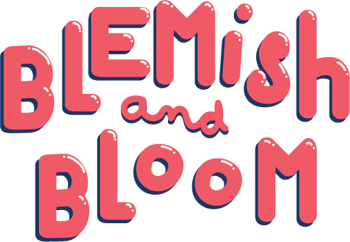
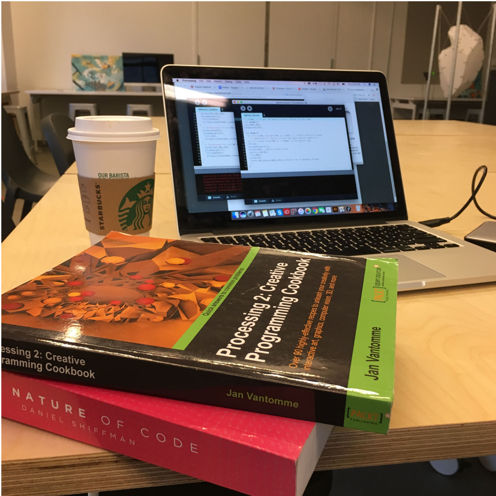
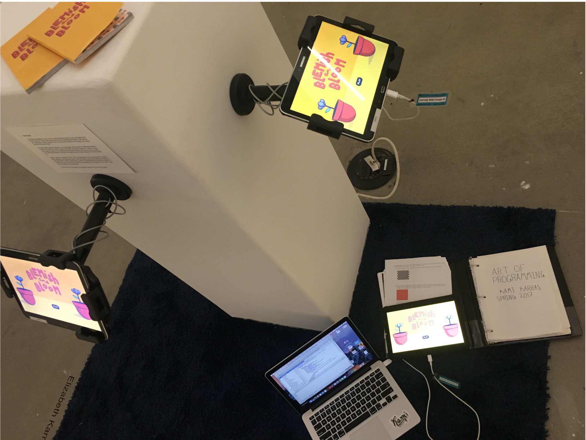
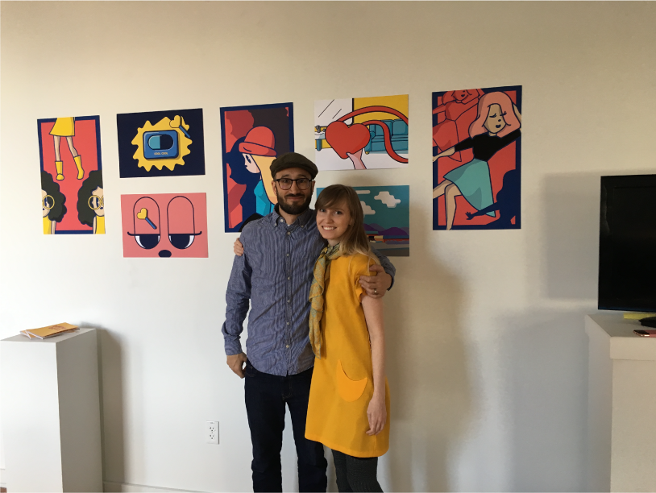

# Blemish and Bloom

## Table of contents
  - about
  - process
  - technologies used
  - author
## About
Blemish and Bloom is a mobile game being designed and built by Kami Karras. The game follows the main character named Allo who begins to be taught how to be a "likeable" girl in the games world. The player is given multiple decisions throughout the game to either follow what they are learning, or try other pursuits instead. Main themes include bullying and social media. 

## Process
The game design and development process for Blemish and Bloom started at PNCA as a design thesis under the mentorship of Zack Rau with an intial focus on script writing and character, background, and style design. Because she was also learning processing she was able to use it to begin developing a demo for the game. Stuggles involved art updates and constant improvements made to the concept of the game while trying to make a demo that was ready for any of these changes while also being BFA student enrolled in 6 classes. The demo uses more memory than processing was intended to use and some development had to be made on the android app studio. 

     

## Technologies used
  - processing
  - java
  - android studio
  - Adobe Illustrator
  

  
## Author
Kami Karras is designer in Portland that fell in love with code while working on her thesis for PNCA. With an artist heart and technical mind, Kami loves to combine her design and coding skills to create beautiful projects.
 
